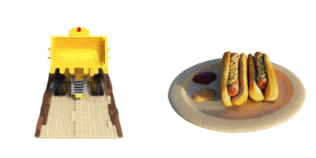
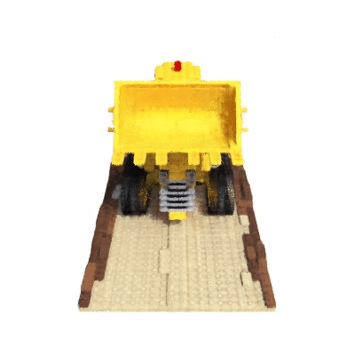

# nerf-pytorch
#### A PyTorch re-implementation
### [Project](http://tancik.com/nerf) | [Video](https://youtu.be/JuH79E8rdKc) | [Paper](https://arxiv.org/abs/2003.08934)

[](https://colab.research.google.com/drive/1rO8xo0TemN67d4mTpakrKrLp03b9bgCX)

[NeRF: Representing Scenes as Neural Radiance Fields for View Synthesis](http://tancik.com/nerf)  
 [Ben Mildenhall](https://people.eecs.berkeley.edu/~bmild/)\*<sup>1</sup>,
 [Pratul P. Srinivasan](https://people.eecs.berkeley.edu/~pratul/)\*<sup>1</sup>,
 [Matthew Tancik](http://tancik.com/)\*<sup>1</sup>,
 [Jonathan T. Barron](http://jonbarron.info/)<sup>2</sup>,
 [Ravi Ramamoorthi](http://cseweb.ucsd.edu/~ravir/)<sup>3</sup>,
 [Ren Ng](https://www2.eecs.berkeley.edu/Faculty/Homepages/yirenng.html)<sup>1</sup> <br>
 <sup>1</sup>UC Berkeley, <sup>2</sup>Google Research, <sup>3</sup>UC San Diego  
  \*denotes equal contribution

<p align="center">
    
</p>

A PyTorch re-implementation of [Neural Radiance Fields](http://tancik.com/nerf).

## Speed matters!

The current implementation is **_blazing fast!_** (**~5-9x faster** than the [original release](https://github.com/bmild/nerf), **~2-4x faster** than this [concurrent pytorch implementation](https://github.com/yenchenlin/nerf-pytorch))

> _What's the secret sauce behind this speedup?_

> Multiple aspects. Besides obvious enhancements such as data caching, effective memory management, etc. I drilled down through the entire NeRF codebase, and reduced data transfer b/w CPU and GPU, vectorized code where possible, and used efficient variants of pytorch ops (wrote some where unavailable). But for these changes, everything else is a faithful reproduction of the NeRF technique we all admire :)


## Sample results from the repo


### On synthetic data

<p align="center"> 
    
</p>

### On real data

<p align="center"> 
    
</p>


## Tiny-NeRF on Google Colab

The NeRF code release has an accompanying Colab notebook, that showcases training a feature-limited version of NeRF on a "tiny" scene. It's equivalent PyTorch notebook can be found at the following URL:

https://colab.research.google.com/drive/1rO8xo0TemN67d4mTpakrKrLp03b9bgCX


## What is a NeRF?

A neural radiance field is a simple fully connected network (weights are ~5MB) trained to reproduce input views of a single scene using a rendering loss. The network directly maps from spatial location and viewing direction (5D input) to color and opacity (4D output), acting as the "volume" so we can use volume rendering to differentiably render new views.

Optimizing a NeRF takes between a few hours and a day or two (depending on resolution) and only requires a single GPU. Rendering an image from an optimized NeRF takes somewhere between less than a second and ~30 seconds, again depending on resolution.


## How to train your NeRF super-quickly!

To train a "full" NeRF model (i.e., using 3D coordinates as well as ray directions, and the hierarchical sampling procedure), first setup dependencies. 

### Option 1: Using pip

In a new `conda` or `virtualenv` environment, run

```bash
pip install -r requirements.txt
```

### Option 2: Using conda

Use the provided `environment.yml` file to install the dependencies into an environment named `nerf` (edit the `environment.yml` if you wish to change the name of the `conda` environment).

```bash
conda env create
conda activate nerf
```

### Run training!

Once everything is setup, to run experiments, first edit `config/lego.yml` to specify your own parameters.

The training script can be invoked by running
```bash
python train_nerf.py --config config/lego.yml
```

### Optional: Resume training from a checkpoint

Optionally, if resuming training from a previous checkpoint, run
```bash
python train_nerf.py --config config/lego.yml --load-checkpoint path/to/checkpoint.ckpt
```

### Optional: Cache rays from the dataset

An optional, yet simple preprocessing step of caching rays from the dataset results in substantial compute time savings (reduced carbon footprint, yay!), especially when running multiple experiments. It's super-simple: run
```bash
python cache_dataset.py --datapath cache/nerf_synthetic/lego/ --halfres False --savedir cache/legocache/legofull --num-random-rays 8192 --num-variations 50
```

This samples `8192` rays per image from the `lego` dataset. Each image is `800 x 800` (since `halfres` is set to `False`), and `500` such random samples (`8192` rays each) are drawn per image. The script takes about 10 minutes to run, but the good thing is, this needs to be run only once per dataset.

> **NOTE**: Do NOT forget to update the `cachedir` option (under `dataset`) in your config (.yml) file!


## (Full) NeRF on Google Colab

A Colab notebook for the _full_ NeRF model (albeit on low-resolution data) can be accessed [here](https://colab.research.google.com/drive/1L6QExI2lw5xhJ-MLlIwpbgf7rxW7fcz3).


## Render fun videos (from a pretrained model)

Once you've trained your NeRF, it's time to use that to render the scene. Use the `eval_nerf.py` script to do that. For the `lego-lowres` example, this would be
```bash
python eval_nerf.py --config pretrained/lego-lowres/config.yml --checkpoint pretrained/lego-lowres/checkpoint199999.ckpt --savedir cache/rendered/lego-lowres
```

You can create a `gif` out of the saved images, for instance, by using [Imagemagick](https://imagemagick.org/).
```bash
convert cache/rendered/lego-lowres/*.png cache/rendered/lego-lowres.gif
```

This should give you a gif like this.

<p align="center">
    
</p>


## A note on reproducibility

All said, this is not an official code release, and is instead a reproduction from the original code (released by the authors [here](https://github.com/bmild/nerf)).

The code is thoroughly tested (to the best of my abilities) to match the original implementation (and be much faster)! In particular, I have ensured that
* Every _individual_ module exactly (numerically) matches that of the TensorFlow implementation. [This Colab notebook](https://colab.research.google.com/drive/1ENrAtZIEhoeNkaXOXkBL7SbWU1VWHBQm) has all the tests, matching op for op (but is very scratchy to look at)!
* Training works as expected (for Lego and LLFF scenes).

The organization of code **WILL** change around a lot, because I'm actively experimenting with this.

**Pretrained models**: Pretrained models for the following scenes are available in the `pretrained` directory (all of them are currently lowres). I will continue adding models herein.
```
# Synthetic (Blender) scenes
chair
drums
hotdog
lego
materials
ship

# Real (LLFF) scenes
fern
```


## Contributing / Issues?

Feel free to raise GitHub issues if you find anything concerning. Pull requests adding additional features are welcome too.


## LICENSE

`nerf-pytorch` is available under the [MIT License](https://opensource.org/licenses/MIT). For more details see: [LICENSE](LICENSE) and [ACKNOWLEDGEMENTS](ACKNOWLEDGEMENTS).

## Misc

Also, a shoutout to [yenchenlin](https://github.com/yenchenlin) for his cool PyTorch [implementation](https://github.com/yenchenlin/nerf-pytorch), whose volume rendering function replaced mine (my initial impl was inefficient in comparison).
